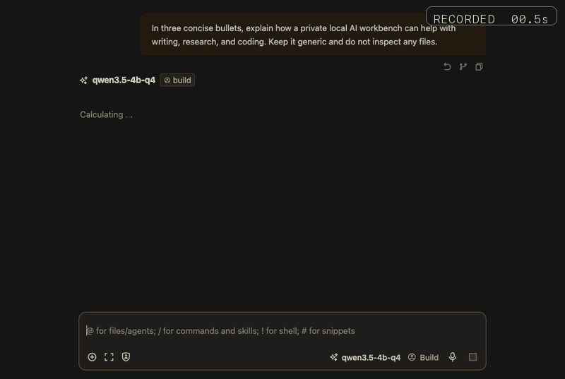
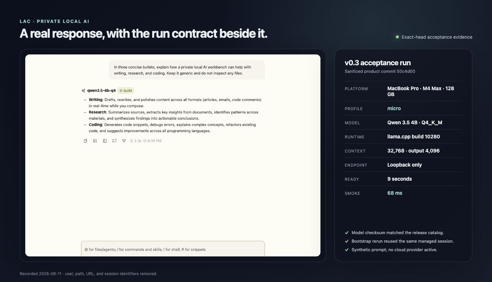
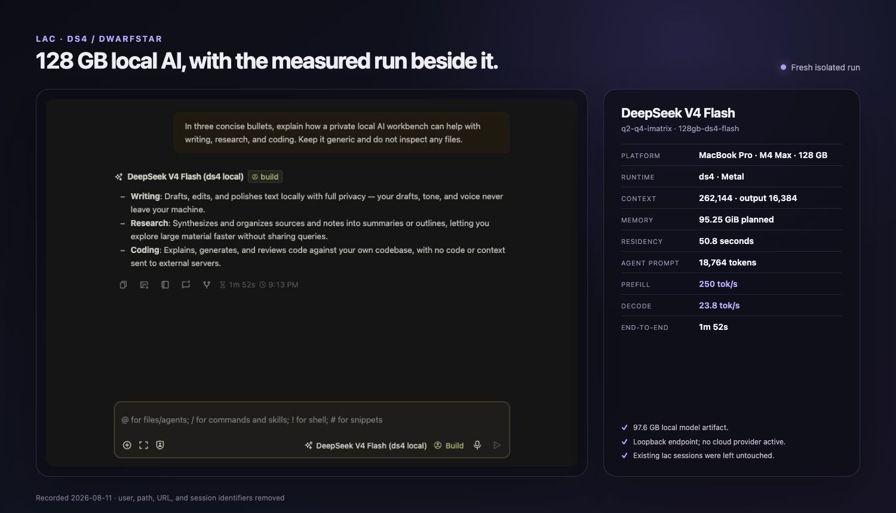

# lac — private local AI matched to your hardware

**lac turns a supported MacBook into a private local AI workbench with a model sized to its memory.** Use it for writing, research, coding, document work, and local automations without requiring an account or hosted inference.

When a local model is active and `lac doctor` reports no unresolved OpenCode coexistence warning,
prompts and work content stay on the device. Installation and first plugin use still download
dependencies; cloud profiles have their own provider privacy terms.


<p align="center"><sub>Illustration — lac keeps the model, runtime, and client connection on one machine.</sub></p>

**Supported platform: Apple Silicon MacBooks.** Windows, Linux, Intel Macs, ordinary iGPUs,
Snapdragon/Adreno, and other unverified hardware are experimental and **test at your own risk**.
Parser and configuration checks on those platforms are not a physical-runtime support guarantee.

Built on [llama.cpp](https://github.com/ggml-org/llama.cpp), [Unsloth](https://unsloth.ai) model quantizations, [OpenCode](https://opencode.ai), and [OpenChamber](https://github.com/openchamber/openchamber). Optional [oMLX](https://github.com/danielzgtg/omlx) on Apple Silicon.

> `lac` stands for "lightweight agentic coding." Coding remains a first-class use case, but the
> same local engine also supports writing, research, document work, and other private workflows.

## Get started on a Mac

On a Mac, clone the release and run its bootstrap. It installs the prerequisites and model over the network, then opens a chat backed by local inference. The v0.3 clean-install contract pins OpenCode 1.17.18 and OpenChamber 1.16.3; an existing different version is left in place with a warning. If OpenChamber cannot be installed, the same flow falls back to OpenCode:

```bash
git clone https://github.com/grezkium-toolshed/lightweight-agentic-coding.git
cd lightweight-agentic-coding
./scripts/bootstrap.sh
```

It is safe to rerun: valid prerequisites and model weights are reused, while lac and its validation may run again. A healthy lac-managed OpenChamber web session is reused instead of starting duplicate UI and OpenCode processes. When it finishes, the [OpenChamber](https://github.com/openchamber/openchamber) chat UI is available on its local default or selected port, backed by a small local model. Run `lac ports show --json` for the effective URL and `lac doctor --json` for the resolved storage paths and OpenCode coexistence warnings.

Windows is experimental. Use **WSL2 for local models**; the guarded native PowerShell script is only
for machines where Python, `llama-server.exe`, and OpenCode are already installed. OpenChamber
Desktop with OpenCode Go/Zen is the lower-friction cloud alternative, but it is not local-only.
See the [Windows routes and requirements](docs/WINDOWS.md).

<details>
<summary>Prefer to set it up by hand? (click to expand)</summary>

Install [llama.cpp](https://github.com/ggml-org/llama.cpp), [OpenCode](https://opencode.ai), and [OpenChamber](https://github.com/openchamber/openchamber) yourself (see their docs), make sure Python 3.10+ is present, then:

```bash
python3 -m pip install --user pipx
python3 -m pipx ensurepath
pipx install .                    # installs `lac` in an isolated environment
lac init                          # detects your RAM, recommends a profile
lac models sync                   # downloads weights for the active profile
lac runtime start                 # starts the local server (default port: 8080)
lac client open openchamber       # opens the chat UI  (or: lac client open opencode)
```

`lac demo --local` is the quick path: it downloads a tiny 2.5 GB model and opens the chat UI in one step.
If pipx is unavailable, use a dedicated virtual environment rather than installing lac into a
shared system or project Python environment.
</details>

## What it looks like

OpenChamber provides the chat interface while lac manages the local model, runtime, context limits,
and client configuration underneath it.

### Qwen 4B responding locally



<p align="center"><sub>Fresh isolated local run using a synthetic prompt. The showcase plays at 3× speed; the measured response completed in 25.2 seconds and the final frame pauses briefly for readability. No cloud provider was active.</sub></p>

### Measured Qwen 4B run



<p align="center"><sub>Anonymized local Qwen 4B session with a synthetic prompt, alongside the recorded v0.3 acceptance-run contract. No cloud provider was active.</sub></p>

### Measured 128 GB ds4 run



<p align="center"><sub>Fresh isolated M4 Max run using the same synthetic prompt. The 18,764-token agent pass completed locally in 1m52s; no cloud provider was active.</sub></p>

## First out of the Grezkium Toolshed

lac is the first public release in a planned four-tool Toolshed line-up. Three more products are
being prepared: **M365 Threat Digest** for reviewed threat context, **M365 Maturity Tracker** for
evidence-driven assessment and customer reporting, and **Tenantsmith** for deterministic,
approval-gated Microsoft 365 changes. They are forthcoming products, not current lac integrations
or dependencies. lac works independently today and will continue to do so.

## What you get

A local AI assistant running on **your** machine:

- **Local model by default** — the model runs on `localhost`. Existing OpenCode configuration is merged, so resolve any `lac doctor` sharing/plugin/MCP/provider warning before treating a session as local-only.
- **A chat window** (OpenChamber) for writing, research, summarizing, and document work — plus an agentic coding CLI (OpenCode) when you want it.
- **Matched to your hardware** — `lac init` recommends the strongest validated model that fits the effective accelerator-memory budget with headroom for the OS, runtime, context, and KV cache.
- **Reproducible configuration** — exposed models, context limits, output headroom, and supplemental DCP thresholds are generated from one active profile. External runtime and model-artifact validation limits are documented separately.

## Will this run on my machine?

Probably — but speed depends heavily on the accelerator and its usable memory. `lac init` treats dedicated VRAM, ordinary iGPU budgets, Apple unified memory, and Snapdragon shared memory separately. A 16 GB Windows/Linux laptop whose iGPU can use only 4–6 GB belongs in the 4–6 GB rows, not the 16 GB row. Any visible but unmeasured accelerator conservatively selects `4gb` and reports low confidence. WSL2 also selects `4gb` when it cannot measure an accelerator; native CPU-only machines may use system RAM.

| Memory target | Typical hardware / memory type | Default profile and model weights | Validation | Realistic workload |
|---:|---|---|---|---|
| 4 GB | 16 GB Windows/Linux laptop with an unmeasured or ~4 GB iGPU budget | `4gb`: Qwen3.5 4B Q4, ~2.6 GB | standard | Chat, proofreading, single-shot edits at 32K |
| 6 GB | 16 GB Windows/Linux laptop with a measured ~6 GB iGPU budget | `6gb`: Qwen3.5 9B Q4, ~5.5 GB | standard | Constrained short agentic tasks at 32K |
| 8 GB | True 8 GB accelerator budget | `8gb`: Qwen3.5 9B Q4, ~5.5 GB | standard | Small-model tool use and short 32K sessions |
| 12 GB | True 12 GB accelerator budget | `12gb`: Qwen3.5 9B Q8, ~9.7 GB | standard | Constrained multi-step work at 64K |
| 16 GB | Apple Silicon unified memory | `macos-16gb`: Gemma 4 12B QAT, ~6.4 GB | standard | Everyday work with macOS headroom |
| 16 GB | Dedicated VRAM or CPU-only system RAM | `16gb`: Qwen 3.6 27B IQ3, ~12.2 GB | verified | Constrained larger-model work |
| 24 GB | Dedicated VRAM or unified memory | `24gb`: Qwen 3.6 27B Q4, ~17 GB | verified | General daily driver |
| 32 GB | Dedicated VRAM or unified memory | `32gb`: Qwen 3.6 27B Q4, ~17 GB | standard | Coding, research, and multi-step work |
| 48 GB | Dedicated or Apple unified memory | `48gb`: Qwen 3.6 35B-A3B Q8, ~36 GB | standard, manual only | Candidate local-heavy tier; hardware gate pending |
| 64 GB | Dedicated VRAM or unified memory | `64gb`: Qwen 3.6 35B-A3B Q8, ~36 GB | extended | High-headroom and MTP specialist work |
| 128 GB+ | High-memory unified workstation | `128gb-*`: 36–108 GB defaults | extended | Specialist large-model workflows |

The validation column describes the profile evidence, not platform support. Apple Silicon
MacBooks are the supported platform; every other platform remains experimental until physical
runtime evidence justifies promotion.

The 48 GB tier corresponds to current [MacBook Pro configurations](https://support.apple.com/en-euro/126319), but availability alone is not validation; lac keeps it manual until the recorded smoke-test contract passes.

The target is a safe fit, not maximum memory consumption. For multiple discrete GPUs lac uses the largest single reported budget; multi-GPU selection remains manual. Windows' authoritative target is the OS-provided [DXGI video-memory budget](https://learn.microsoft.com/en-us/windows/win32/api/dxgi1_4/ns-dxgi1_4-dxgi_query_video_memory_info); until that budget is exposed by an available runtime probe, shared GPUs stay conservative. Qualcomm/Adreno is detected separately and reported as experimental acceleration; llama.cpp documents [OpenCL support for Windows 11 ARM64](https://github.com/ggml-org/llama.cpp/blob/master/docs/backend/OPENCL.md), but lac does not promise an NPU path.

## Which profile / model?

`lac init` uses the effective accelerator budget above; you can also choose explicitly. `lac profile list --json` exposes each profile's nominal target, recommendation floor, estimated default weight, automatic-recommendation eligibility, and validation tier.

| Machine | Profile | What you get |
|---|---|---|
| Any machine, lightweight demo | `micro` | Tiny 4B model (~2.5 GB), automatic GPU offload with CPU fallback |
| 4 GB device | `4gb` | Qwen3.5-4B Q4 — chat + light automation |
| 6 GB device | `6gb` | Qwen3.5-9B Q4 with partial offload — smallest practical agentic tier |
| 8 GB device | `8gb` | Qwen3.5-9B Q4/Q6 or Gemma 4 12B QAT (`gemma-8gb`) — the agentic floor |
| 12 GB device | `12gb` | Qwen3.5-9B Q8, 64K context |
| 16 GB dedicated VRAM or CPU-only RAM | `16gb` | Qwen 3.6 27B UD-IQ3_XXS (12.2 GB) |
| 16 GB Apple Silicon Mac | `macos-16gb` | Balanced Apple Silicon default (Gemma 4 12B QAT) |
| 24 GB Mac / workstation | `24gb` | The sweet spot — recommended daily driver |
| 32 GB workstation | `32gb` | Stronger, with MTP speculative decoding |
| 48 GB workstation | `48gb` | 35B-A3B Q8 candidate; explicit selection only pending hardware validation |
| Cloud-only, free | `openrouter` | Zero downloads, free-tier hosted models |

<details>
<summary>Advanced: big-memory & power-user profiles</summary>

For 64 GB+ machines, the Gemma family, and specialist runtimes. These are power-user options — the mid-tier above is the daily driver for most people.

| Profile | What you get |
|---|---|
| `64gb` | Qwen 3.6 35B-A3B Q8 + MTP |
| `128gb-multi` | Multi-model Qwen workstation (llama.cpp) |
| `128gb-qwen122b` | Large-model Qwen-focused (llama.cpp) |
| `128gb-minimax` | MiniMax M2.7 (IQ4_XS) |
| `128gb-ds4-flash` | DeepSeek V4 Flash via [antirez's ds4/DwarfStar](https://github.com/antirez/ds4). Needs a separately-built `ds4-server` (`git clone https://github.com/antirez/ds4 && make`; set `DS4_BIN`). The ceiling of what a top-spec 128 GB MacBook Pro runs locally; the CUDA build (`make cuda-generic`) is community-validated. |
| `gemma-16gb` … `gemma-64gb` | Gemma 4 family, various sizes |
| `opencode-go` | Cloud-only, OpenCode Go subscription |

</details>

## Platform support

**Apple Silicon MacBooks are the tested and supported product platform.** Support is
best-effort with no SLA. The 128 GB ds4/DwarfStar path has measured M4 Max MacBook Pro evidence;
the 48 GB profile remains a manual candidate until it passes its own exact-hardware contract.

Windows, Linux, Intel Macs, ordinary iGPUs, Snapdragon/Adreno, and other unverified hardware are
experimental and test-at-your-own-risk. WSL2 is the preferred Windows local-model route; see the
[Windows guide](docs/WINDOWS.md). Local release checks are authoritative. An optional, manually
triggered GitHub workflow exercises Linux/macOS contracts plus Windows parsing, an installed wheel,
wrappers, and client rendering; it never runs automatically and does not validate GPU drivers,
model loading, performance, or deployment on physical hardware. The isolated clean-install
bootstrap and OpenChamber flow on Apple Silicon remains a release gate.
`lac doctor` reports what your platform is missing.

Installed copies keep mutable data outside the Python package: models and refreshed catalogs use the platform user-data directory, while runtime state uses the platform user-state directory. Override them with `LAC_DATA_ROOT`, `LAC_STATE_ROOT`, or `AI_MODELS_DIR`.

Repository and installed commands now use those same mutable locations. Existing OpenCode global
and project configuration is preserved and merged; lac reports risky effective settings without
blocking launch. Read the [OpenCode coexistence and privacy checks](docs/OPENCODE-COEXISTENCE.md)
before using confidential material with an existing OpenCode installation.

The complete standalone lifecycle—install, health, logs, update, rollback,
uninstall, data retention/purge, privacy, network exposure, and optional sibling
failure behavior—is in [`docs/STANDALONE-OPERATIONS.md`](docs/STANDALONE-OPERATIONS.md).

## Daily use

```bash
lac runtime start                  # Start local server
lac client open openchamber        # Open the chat UI (inspect URL with `lac ports show --json`)
lac client open opencode           # Or the coding agent CLI
lac runtime status                 # Check runtime state
lac runtime stop                   # Stop local server
lac doctor                         # Validate setup
lac ports show --json              # Show effective local service ports
```

All commands support `--json` for scripting.

`lac runtime stop` stops the model server only. Fully quit OpenCode or OpenChamber separately,
especially after changing profiles or generated environment settings.

## Local network ports

lac keeps local services on loopback by default: the model runtime uses `8080`
(oMLX/ds4 use `8000`), OpenChamber uses `3000`, and OpenCode serve uses `4095`.
`lac ports show --json` reports the effective bindings and their source. Use an
explicit override such as `LAC_PORT=8181 lac profile apply 24gb` or
`lac runtime start --port 8181`; an occupied explicit port fails with an
actionable error. Only automatic/default allocations use the documented `+20`
fallback window. Successful starts are recorded in the per-user
`network.v1.json` state record, with allocation source and timestamp; only
automatic fallback allocations are reused by a later no-override launch.
`lac ports reset` clears those saved allocations.

The runtime binds to loopback and connects clients through a separate loopback
address. Remote runtime binding is intentionally unsupported in this release:
lac has no authenticated remote-listener contract, so use an authenticated
tunnel to the loopback runtime instead. OpenChamber remote mode remains explicit:
`lac client open openchamber --remote-host https://host:4095` skips starting a
local OpenCode server and rejects URLs with embedded credentials.

## Where lac fits

lac is a free standalone workbench, not another model marketplace or a Microsoft 365
administration portal. In the wider toolshed it is the private execution layer for
analysis and drafting inside an evidence-driven security delivery loop:

> assess → prioritize → approve → change → verify → explain → repeat

M365 Threat Digest supplies external context, M365 Maturity Tracker assesses and communicates,
lac assists locally, Tenantsmith performs deterministic operator-approved changes, and a future
private Platform may preserve history and scheduling. lac never turns an AI draft into approval
or deployment authority.

The cross-product differentiator is still a candidate until one separately approved
production-pilot control completes that entire loop with before/after evidence. See
[the stack boundary, first-proof contract, and value measures](docs/STACK.md).

## Next steps

- **Windows routes** — WSL2 local models, native cloud, and the manual native preview: [`docs/WINDOWS.md`](docs/WINDOWS.md)
- **Cloud providers** — add OpenRouter, Anthropic API, or OpenCode Go as fallbacks: [`docs/providers/AUTHENTICATION.md`](docs/providers/AUTHENTICATION.md)
- **Product roadmap** — hardware-fit milestones, audience, and explicit non-goals: [`ROADMAP.md`](ROADMAP.md)
- **Evidence-to-proof stack** — lac's role, component boundaries, and the candidate `delivery-run.v1` linking contract: [`docs/STACK.md`](docs/STACK.md)
- **Advanced profiles** — MTP speculative decoding, oMLX on macOS, hybrid local+cloud: [`docs/architecture.md`](docs/architecture.md)
- **Bundled agents & skills** — architecture/release review, documentation, research synthesis, and office workflows (docx/pptx/xlsx/pdf): [`.opencode/agents/`](.opencode/agents/), [`.opencode/skills/`](.opencode/skills/)
- **Design skills & brand systems (opt-in)** — lac does not bundle these; add the [Open Design](https://open-design.ai) catalog yourself: `curl -fsSL https://open-design.ai/install.sh | sh -s opencode`
- **Ponytail (default-on)** — generated OpenCode configs include the [ponytail](https://github.com/DietrichGebert/ponytail) plugin (laziness ruleset + `/ponytail` commands). Disable per session with `PONYTAIL_DEFAULT_MODE=off`. See [`THIRD_PARTY_NOTICES.md`](THIRD_PARTY_NOTICES.md)
- **Context safety** — OpenCode's built-in compaction is the hard overflow guard. DCP adds model-guided compression and cleanup with thresholds generated from the active runtime preset; it is supplemental rather than a guaranteed automatic compressor.
- **Existing OpenCode installs** — merge precedence, advisory warnings, shared auth/session state, and safe workspace practice: [`docs/OPENCODE-COEXISTENCE.md`](docs/OPENCODE-COEXISTENCE.md)
- **Qwen 3.8 candidate prep** — placeholder config slots exist, but no profile switches without official artifacts and hardware evidence: [`docs/models/QWEN38_READY.md`](docs/models/QWEN38_READY.md)
- **Free cloud model catalog** — `lac catalog sync-free`, see [`docs/free-coding-models.json`](docs/free-coding-models.json)
- **Model deep dive** — tuning rationale, profile details: [`docs/model-recommendations.md`](docs/model-recommendations.md)
- **Agentic analysis of assessment exports** — model capability review, harness assessment, and the agentic-only-folder workflow (staging script + skill implemented): [`docs/assessments/`](docs/assessments/)

## Troubleshooting

| Symptom | Fix |
|---|---|
| `Connection refused` | Start runtime: `lac runtime start`. Run `lac doctor --json` for the exact `paths.log_root`, or use the `Tail logs` command printed by `lac runtime start`. |
| `Cannot open file` | Run `lac models sync <profile>`. Check `AI_MODELS_DIR` and profile config |
| Model sync fails | Re-run the same command. Install Hugging Face CLI for resume support |
| OpenCode misses config | Re-run `lac init`. For Desktop, quit and relaunch after profile switch |
| OpenCode coexistence warning | Review `lac doctor --json` and [`docs/OPENCODE-COEXISTENCE.md`](docs/OPENCODE-COEXISTENCE.md). Warnings do not block launch. |
| Cloud provider skipped | Set the provider env var, then `lac provider verify <provider>` |
| Config parse error | Re-render: `lac profile apply <profile>`. Run `lac doctor --strict` |

## Acknowledgments

lac is a thin orchestration layer standing on the shoulders of:

- **[llama.cpp](https://github.com/ggml-org/llama.cpp)** by Georgi Gerganov and contributors — the local inference engine
- **[Unsloth](https://unsloth.ai)** — model quantizations and tuning guidance for Qwen and Gemma families
- **[OpenCode](https://opencode.ai)** — the agentic coding client
- **[Open Design](https://open-design.ai)** by nexu-io — design skills, craft rulebooks, and brand design systems
- **[oMLX](https://github.com/danielzgtg/omlx)** — optional macOS MLX inference backend
- **[ds4/DwarfStar](https://github.com/antirez/ds4)** by Salvatore Sanfilippo — optional 128GB+ Apple Silicon DeepSeek V4 Flash runtime path
- **[ponytail](https://github.com/DietrichGebert/ponytail)** by Dietrich Gebert — laziness ruleset pre-wired into generated OpenCode configs
- **[OpenChamber](https://github.com/openchamber/openchamber)** by @btriapitsyn — web/mobile/desktop remote access
- **[free-coding-models](https://github.com/vava-nessa/free-coding-models)** by @vava-nessa — free cloud model index and NIM helper tooling
- **[Qwen](https://github.com/QwenLM/Qwen)** and **[Gemma](https://ai.google.dev/gemma)** model families

See [`THIRD_PARTY_NOTICES.md`](THIRD_PARTY_NOTICES.md) for bundled asset
attribution and runtime/model source notes.

## Contributing

See [`CONTRIBUTING.md`](CONTRIBUTING.md) for setup, coding style, and submission guidelines.
See [`CODE_OF_CONDUCT.md`](CODE_OF_CONDUCT.md) for community expectations.
See [`SUPPORT.md`](SUPPORT.md) for issue routing and best-effort community support expectations.
